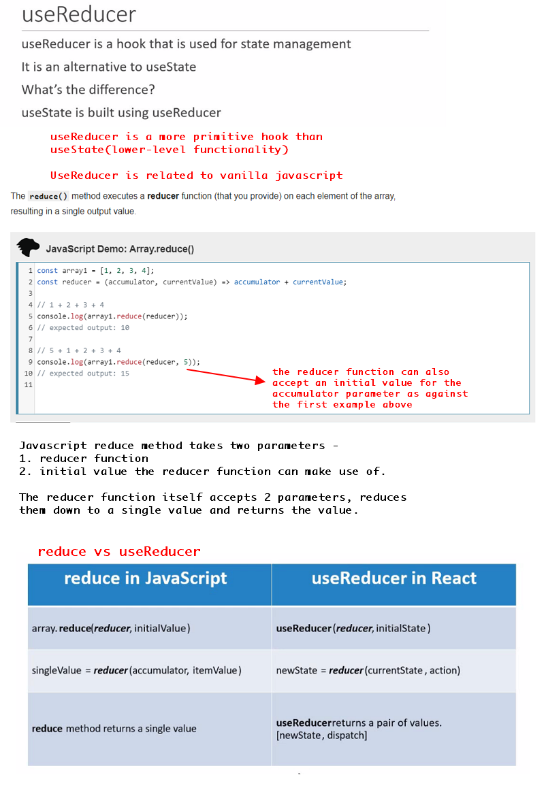

### Implementation

1. Using useReducer for local state management - managing state within a component

2. Using useReducer for global state management - Sharing state btw components. This is done by combining useReducer with useContext

3. Fetching data from an api with useReucer
